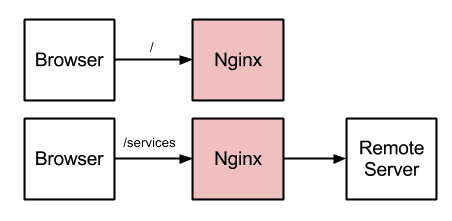

# Enable CORS in your App using nginx

Nginx as Reverse Proxy (and web server) for the webdev :)

## Using Nginx in reverse proxy mode

In my case, I'm going to use nginx as the **light red box** handling all the request to the backend deployed somewhere.

## Configuration files for nginx

1. [mime.types](https://raw.github.com/dendril/nginx/master/conf/mime.types)
2. [nginx.conf](https://raw.github.com/dendril/nginx/master/conf/nginx.conf)

### OSX install

1. brew install nginx
2. Use the config files provided and place them into /usr/local/etc/nginx/
3. Change the line 76 and 83 with your environment settings
4. sudo nginx for a quick test

### Windows install

1. [Download nginx stable](http://nginx.org/en/download.html)
2. Use the config files provided and place them inside the uncompressed version of nginx
3. Create the follwing directories inside the uncompressed version of nginx:
   1. spool
   2. run
   3. logs
4. Add the nginx directory to your PATH
5. Open cmd /D
6. Run nginx

# References

1. [An approach for handling multiple configurations](http://tumblr.intranation.com/post/766288369/using-nginx-reverse-proxy)
2. [Nginx cookbook - reverse proxy chapter](http://www.packtpub.com/sites/default/files/4965-chapter-7-nginx-as-a-reverse-proxy.pdf)
